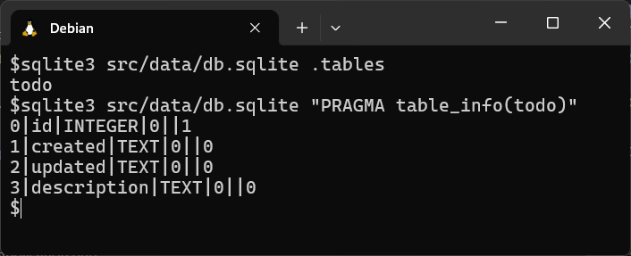

# Todo - Simple App

## How to create a PHP module

this guide uses Bootstrap version 5

## Goal

Create a todo module

## Recipe

Follow the Getting Started guide at <https://github.com/bravedave/dvc>

* the rest of this tutorial assumes
  1. the getting stated has been run successfully
  1. the namespace root is src/app

### note

the Getting Started guide means you can see the app at in your browser at <http://localhost:8080/>.

## Creating an application

The code is being created within the "todo" namespace, and a DVC Controller is being created to directly reference it.

In DVC, controllers are located in the "src/controller" directory, and the specific controller being created in this case is also named "todo".

1. Create a folder for the namespace at src/app/todo
1. Create a folder at src/controller
1. Create the referencing controller
   * Create a file src/controller/todo.php

```php
<?php
// file: src/controller/todo.php
class todo extends todo\controller {}
```

this points us into our namespace and we are ready to code out application...

### Create a config

a central config file is useful for specifying constants

Create a file src/todo/config.php

```php
<?php
// file: src/todo/config.php
namespace todo;

class config extends \config {  // noting: config extends global config classes
  const label = 'Todo';  // general label for application

}
```

### Create the controller

create a file src/todo/controller.php

```php
<?php
// file: src/todo/controller.php
namespace todo;

use strings;

class controller extends \Controller {
  protected function _index() {
    // these lines is temporary
    print 'hello from todo ..';
    return;
    // these lines is temporary

    $this->title = config::label;

    $this->renderBS5([
      'aside' => fn () => $this->load('blank'),
      'main' => fn () => $this->load('blank')
    ]);
  }

  protected function before() {
    parent::before();

    $this->viewPath[] = __DIR__ . '/views/';  // location for module specific views
  }

  protected function postHandler() {
    $action = $this->getPost('action');
    parent::postHandler();
  }
}
```

>the app now runs at <http://localhost:8080/todo> and says *hello from todo ..*<br>
**special note : the url is /todo**

* remove the lines between *"these lines is temporary"* inclusive of those lines, the app will still run, you have a navbar, footer and blank views .. a clean start

>you can create a navbar and footer, it's not required as this is a module, so a navbar and footer is probably more global than this, to create one, create a file at *src/app/views/navbar-default.php* and *src/app/views/footer.php* -  and use the bootstrap examples

so ... to the app

### Create an Index page

* Create a folder at *src/todo/views*
* Add a file *src/todo/views/index.php*

```php
<?php
// file: src/todo/views/index.php
namespace todo;  ?>

<h6 class="mt-1">Todo</h6>
```

1. Modify the controllers secondary view to load 'index'
    * at about line 13 of *src/todo/controller.php*

```php
  'aside' => fn () => $this->load('index'),
```

#### Connect to a database

>Note the data folder is created with a .gitignore file, do not upload the data folder to a public repository
>To save data we will need a database, there are many... *DVC* supports SQLite, mysql and mariadb.

* rename src/data/defaults-sample.json to src/data/defaults.json
  * db_type is the important line - noting it is sqlite, refresh your page and the data file *db.sqlite* is created in the data folder

#### Design a Table

>*The goal is to maintain a table of computer assets, previously we noted the information required to be stored. The objective is to create a table definition and use DVC's builtin table maintenance system*

* When thinking database/table/records, *DVC* uses DAO and DTO.
  * **DAO (Data Access Object)** is a design pattern that abstracts data access implementation.
  * **DTO (Data Transfer Object)** is a simple object that transfers data between different parts of an application, allowing them to communicate with each other, regardless of location.
  * DAO is used for data access, and DTO is used for data transfer.

* Create the folders src/todo/dao, and src/todo/dao/db
* Create a file src/todo/dao/db/todo.php

```php
<?php
// file: src/todo/dao/db/todo.php

namespace todo\dao\db;

use bravedave;

$dbc = bravedave\dvc\sys::dbCheck('todo');

/**
 * note:
 *  id, autoincrement primary key is added to all tables - no need to specify
 *  field types are MySQL and are converted to SQLite equivalents as required
 */

$dbc->defineField('created', 'datetime');
$dbc->defineField('updated', 'datetime');

$dbc->defineField('description', 'text');

$dbc->check();  // actually do the work, check that table and fields exist
```

#### Initiate Auto Table Maintenance

>*DVC*'s table maintenance is simple, it can add fields that are missing. It maintains a version, of if you increment the version, it checks that table. It can maintain indexes also.

* Find and copy the maintenance file into the dao folder, adjust the namespace

```bash
cp vendor/bravedave/dvc/tests/app/dao/dbinfo.php src/app/todo/dao/
```

* just fix up the namespace, it won't error but the default is not correct

```php
<?php
// file: src/todo/dao/dbinfo.php
namespace todo\dao;

use bravedave\dvc\dbinfo as dvcDbInfo;

class dbinfo extends dvcDbInfo {
  /*
   * it is probably sufficient to copy this file into the <application>/app/dao folder
   *
   * from there store you structure files in <application>/dao/db folder
   */
  protected function check() {
    parent::check();
    parent::checkDIR(__DIR__);
  }
}
```

>all that is required is to call the checking routine, this will create any tables from template files in the db folder. it will also maintain a file in the data folder of table versions (src/data/db_version.json)
>Do this as part of your *config*

* modify file src/todo/config.php

```php
<?php
// file : src/todo/config.php
namespace todo;

class config extends \config {  // noting: config extends global config classes
  const todo_db_version = 1;

  const label = 'Todo';  // general label for application

  static function todo_checkdatabase() {
    $dao = new dao\dbinfo;
    // $dao->debug = true;
    $dao->checkVersion('todo', self::todo_db_version);
  }
}
```

* Add a checking routine to the controller to call the checking routine regularly

> before is a routine of the controller class, it's called at the end of __construct, note we have added the location of module specific views, we use that later in edit and matrix reporting

```php
// file : src/todo/controller
  protected function before() {
    config::todo_checkdatabase();  // add this line
    parent::before();

    $this->viewPath[] = __DIR__ . '/views/';  // location for module specific views
  }
```

refresh the browser at <http://localhost:8080/todo> it will create the table

>Tip : To see the table directly from the command line, use the sqlite3 utility<br>
>

almost done with the database, two more files will round this out

##### DTO - Data Transition Object

>The DTO will allow us to have a blank record - it contains default values - we will use this to create new records

* create a folder src/todo/dao/dto
* create a file src/todo/dao/dto/todo.php

```php
<?php
// file: src/todo/dao/dto/todo.php
namespace todo\dao\dto;

use bravedave\dvc\dto;

class todo extends dto {
  public $id = 0;
  public $created = '';
  public $updated = '';

  public $description = '';
}
```

##### DAO - Data Access Object

>the dao has a few default action *getByID( $id)* for instance returns a dto of the given id

* create a file src/todo/dao/todo.php

```php
<?php
// file : src/todo/dao/todo.php
namespace todo\dao;

use bravedave\dvc\dao;

class todo extends dao {
  protected $_db_name = 'todo';
  protected $template = dto\todo::class;

  public function Insert($a) {
    $a['created'] = $a['updated'] = self::dbTimeStamp();
    return parent::Insert($a);
  }

  public function UpdateByID($a, $id) {
    $a['updated'] = self::dbTimeStamp();
    return parent::UpdateByID($a, $id);
  }
}
```

that wraps up storage, lets create the report matrix

#### Report Matrix

Create a file src/todo/views/matrix.php
> for the first time in this tutorial my preference for jQuery is exposed, and you can see my own library - yes, you can use it, and for this tutorial it is useful, but i'd recommend you build your own

##### Part 1. The matrix file

The is the CRUD part, it will;

1. Create - Facilitate adding new items
1. Read - Display the matrix
1. Update - Facilitate editing the items
1. Delete - Facilitate deleting items

Note that this creates 4 requirements for Part 2. The ajax access servicing component - in particular we need to handle the actions of

1. todo-get-matrix
1. todo-add
1. todo-update
1. todo-delete

```php
<?php
// file: src/todo/views/matrix.php
namespace todo;

use bravedave\dvc\strings;  ?>

<div class="container p-4" id="<?= $_container = strings::rand() ?>"></div>
<script>
  (_ => {
    const container = $('#<?= $_container ?>');

    const addItem = () => {

      /*--- ---[add new todo]--- ---*/
      $(`<div class="row g-2 mt-2">
          <div class="col">
            <input type="text" class="form-control js-new-todo" name="description" placeholder="new todo">
          </div>
        </div>`)
        .on('change', function(e) {

          if ('' != this.value) {

            const data = {
              action: 'todo-add',
              description: this.value
            };

            $(this).replaceWith(
              `<div class="input-group">
                <div class="bg-success text-white form-control">${this.value}</div>
                <div class="input-group-text">
                  <div class="spinner-grow spinner-grow-sm"></div>
                </div>
              </div>`);

            _.fetch.post(_.url('<?= $this->route ?>'), data)
              .then(d => 'ack' == d.response ? container.trigger('refresh') : _.growl(d));
          }
        })
        .appendTo(container)
        .focus();
      /*--- ---[/add new todo]--- ---*/
    };

    const getMatrix = () => new Promise(resolve => {
      _.fetch
        .post(_.url('<?= $this->route ?>'), {
          action: 'todo-get-matrix'
        }).then(d => 'ack' == d.response ? resolve(d.data) : _.growl(d));
    });

    const matrix = data => {

      container.emtpy().append('<h4><?= config::label ?></h4>');

      $.each(data, (i, dto) => {

        const row = $(
            `<div class="row g-2 js-todo">
              <div class="col p-2 border border-light js-description">${dto.description}</div>
              <div class="col-auto">
                <button type="button" class="btn btn-light js-delete">
                  <i class="bi bi-trash"></i>
                </button>
              </div>
            </div>`)
          .data('dto', dto)
          .on('delete', function(e) {

            _.hideContexts(e);

            _.ask.alert.confirm({
              title: 'Confirm Delete',
              text: 'Are you sure ?'
            }).then(e => {

              _.fetch
                .post(_.url('<?= $this->route ?>'), {
                  action: 'todo-delete',
                  id: dto.id
                }).then(d => {
                  if ('ack' == d.response) {
                    $(this).closest('div.js-todo').remove();
                  } else {
                    _.growl(d);
                  }
                });
            });
          })
          .appendTo(container);

        // note, using one instead of on to avoid multiple handlers, once activated that's it
        row.find('.js-description')
          .one('click', function(e) {

            _.hideContexts(e);

            let fld = $('<input type="text" class="form-control">')
              .val(dto.description)
              .on('blur', function(e) {

                fld.trigger('save');
              })
              .on('keypress', function(e) {

                if (13 == e.keyCode) {
                  e.stopPropagation();

                  fld.trigger('save');
                }
              })
              .on('save', function(e) {
                e.stopPropagation();

                let _fld = $(this);
                let _row = _fld.closest('div.js-todo');
                let _dto = _row.data('dto');
                let data = {
                  action: 'todo-update',
                  id: _dto.id,
                  description: _fld.val()
                };

                _.fetch
                  .post(_.url('<?= $this->route ?>'), data)
                  .then(d => 'ack' == d.response ?
                    container.trigger('refresh') :
                    _.growl(d));
              });

            $(this)
              .removeClass('p-2 border border-light')
              .empty()
              .append(fld);

            fld.focus();
          })

        row.find('.js-delete').on('click', function(e) {
          e.stopPropagation();

          $(this).closest('div.js-todo').trigger('delete');
          this.innerHTML = '<div class="spinner-grow spinner-grow-sm"></div>';
        });
      });

      addItem(); // adds the controls to add an item
    };

    container.on('refresh', e => getMatrix().then(matrix));
    _.ready(() => container.trigger('refresh'));
  })(_brayworth_);
</script>
```

##### Part 2. - Ajax Servicing Routines